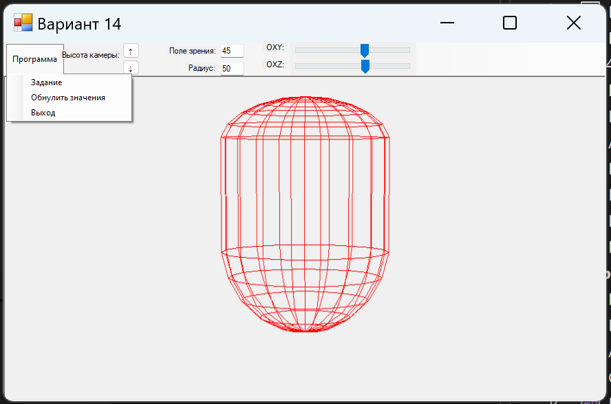
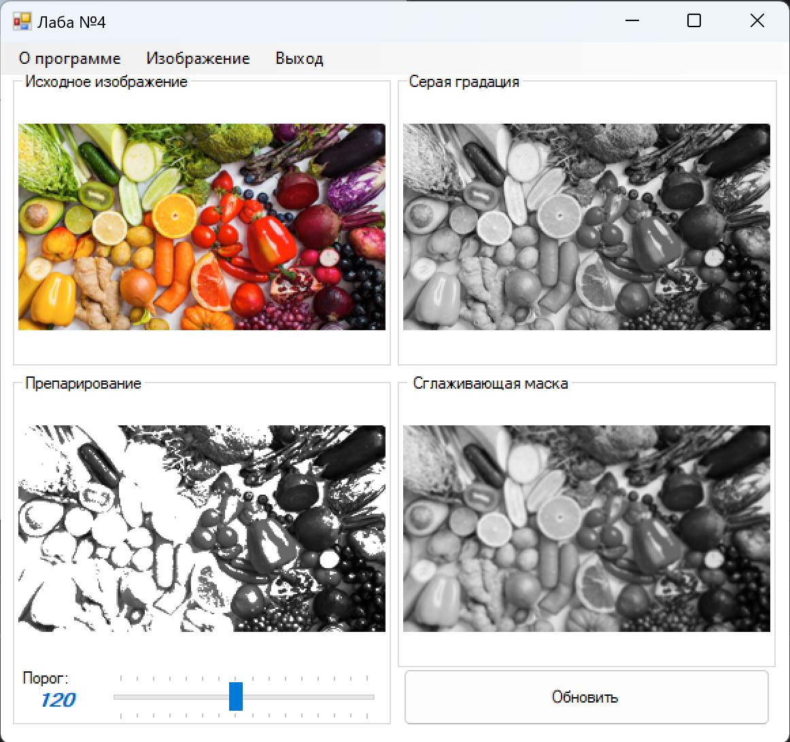
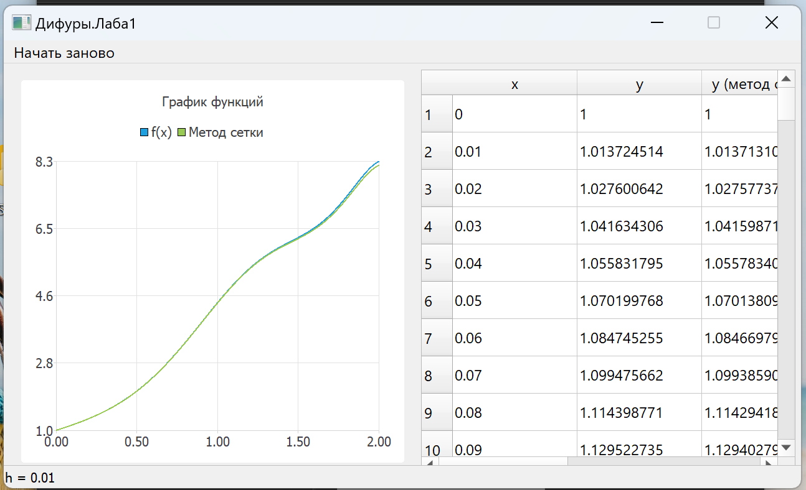
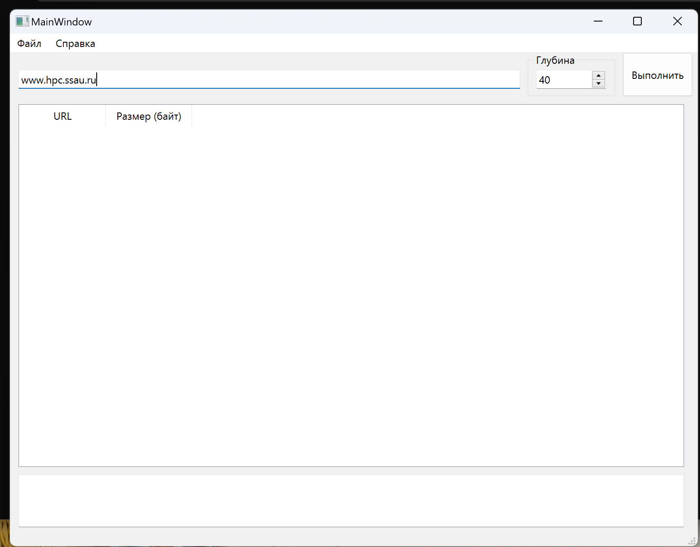
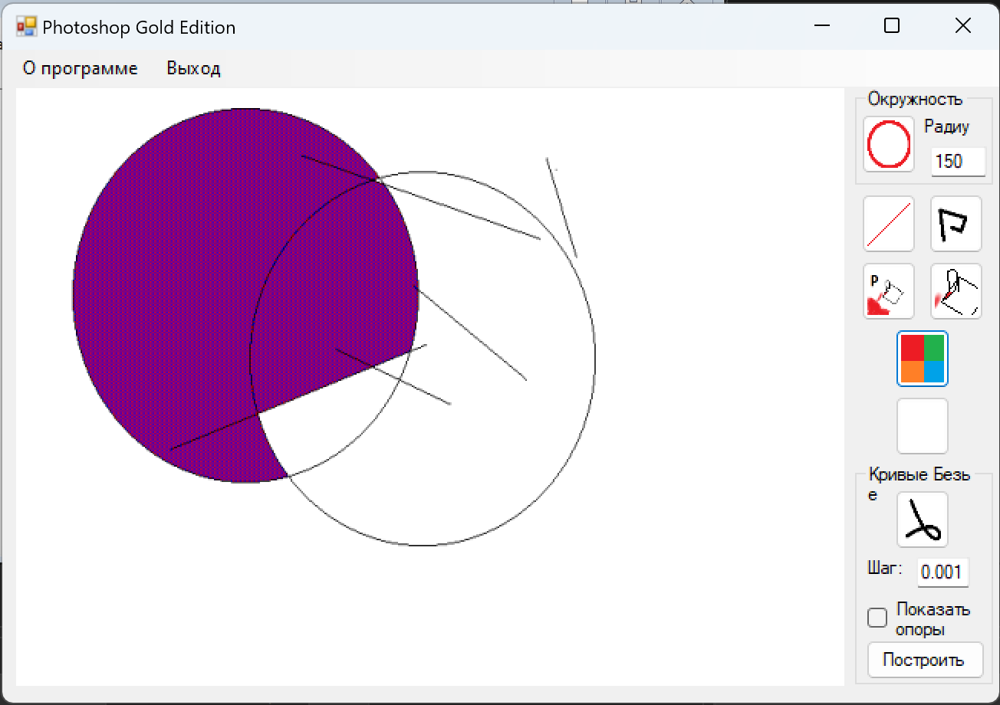
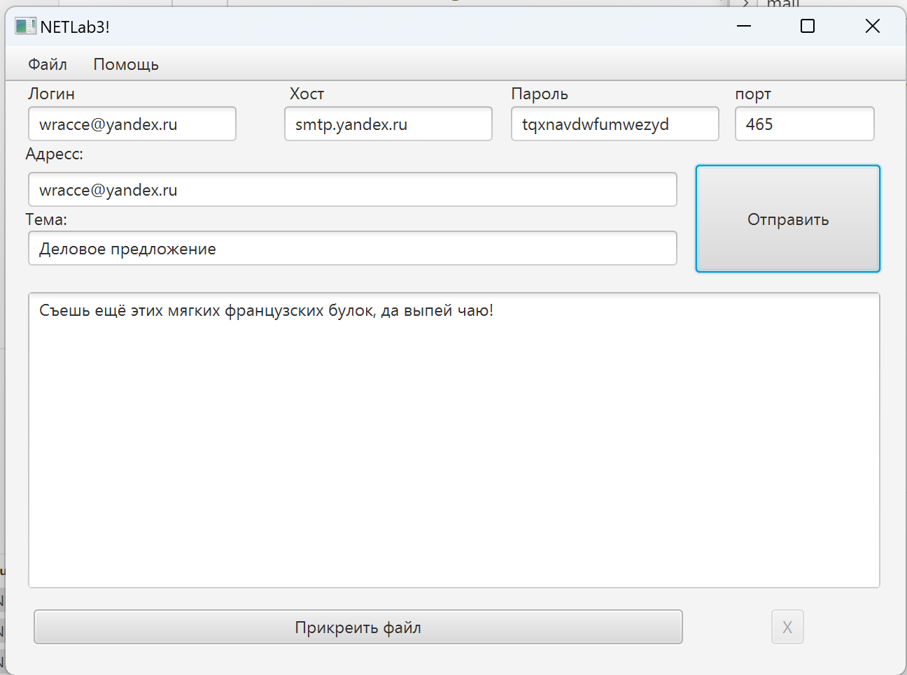
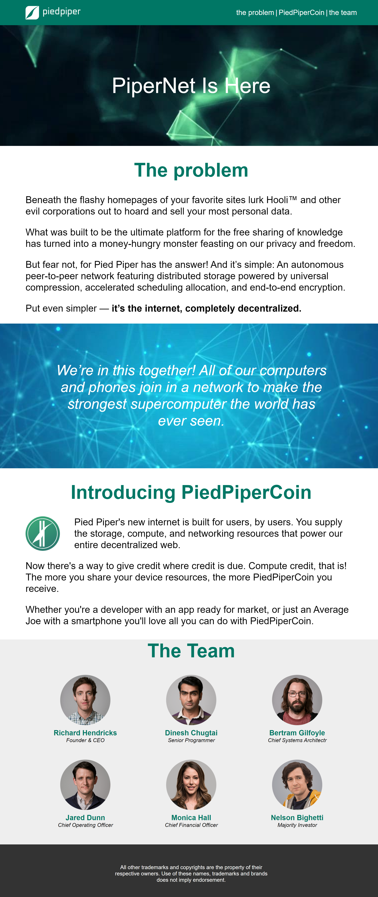
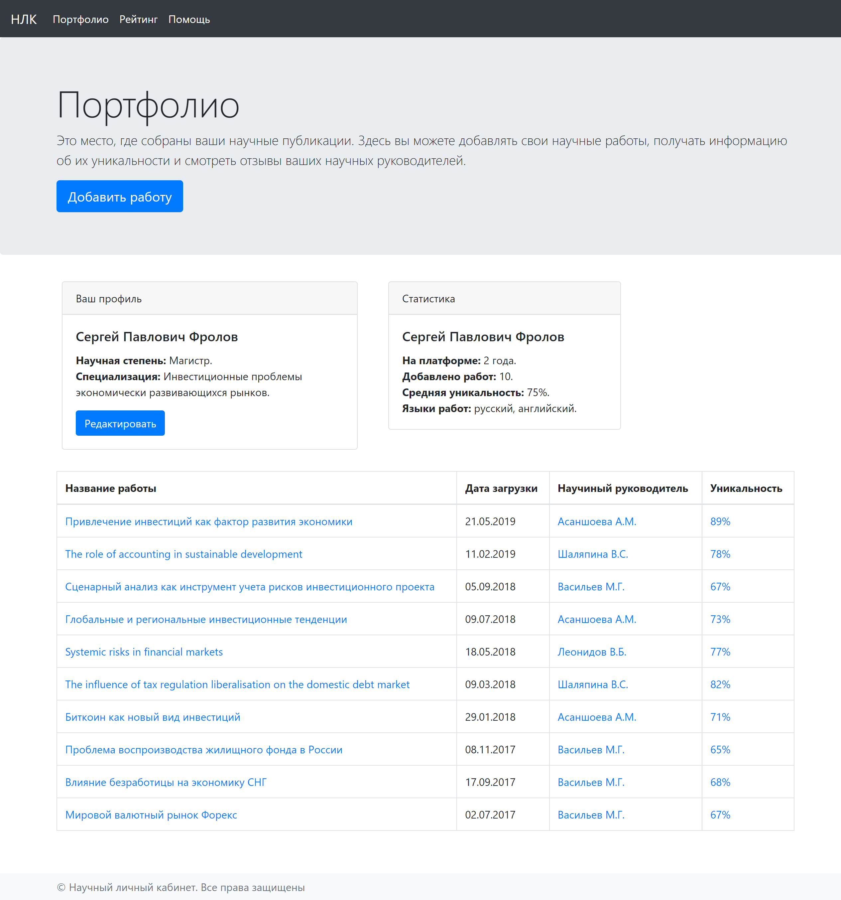
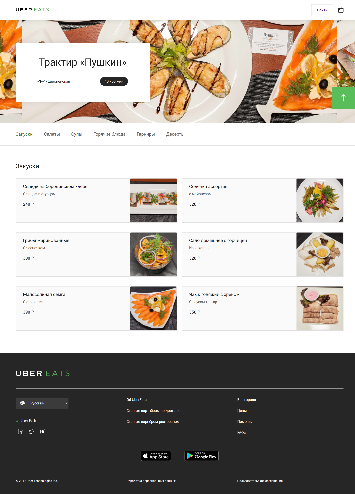

# Курсы, лабы, практики

## 🎓 Лабораторные работы - Самарский университет

#### 3D движок
Использование мировых координат для преобразование трезмрных моделей в проекции. C#, .NET

   

#### Алгоритмы препарирование фотографии
Изучение алгоритмов для работы с фотографиями по извлечению пользной информации. C#, .NET

   

#### Сравнение способов численного дифференцирования
Сравнение метода Рунге-Кутта с методом сеток. C++, QT, QT Charts

   

#### FTP клиент
Простой клиент реализованный на протоколе FTP. C++, Qt

   

#### Рисовалка
Простой инструмент для создания рисунков. C#, .NET

   

#### Email клиент
Простой способ доставить сообщения на email. Java, JavaFX,JavaEE,SMTP

   

## 💻 [Веб-разработка для начинающих: HTML и CSS](https://stepik.org/course/38218/promo) - ITC
Курс о основах WEB-разработки. Изучаются азы HTML, CSS, flex, bootstrap, Адаптивная верстка, переходы

    

Курс о основах WEB-разработки. Изучаются азы HTML, CSS, flex, bootstrap, Адаптивная верстка, переходы

    

## 💻 [Веб-разработка для начинающих: HTML и CSS](https://stepik.org/course/38218/promo) - ITC
Курс о основах WEB-разработки. Изучаются азы HTML, CSS, flex, bootstrap, Адаптивная верстка, переходы

    

### Подробнее

#### PiperNet
Лендинг страница. Используется normilize.css, адаптивная верстка.

    

#### Портфолио
Портфолио. Используется bootstrap.

    

#### UberEats
Меню ресторана. Используется адаптивная верстка, normilize.css, flexboxgrid2.

    
    

## 📕 [Grokking Algorithms](https://www.manning.com/books/grokking-algorithms) - Aditya Y. Bhargava
Исходный код содержат решения практический задач на языках: TypeScript, JavaScript, C++.

    

